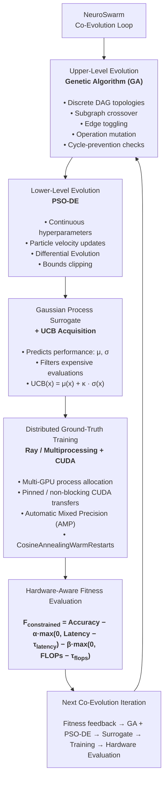
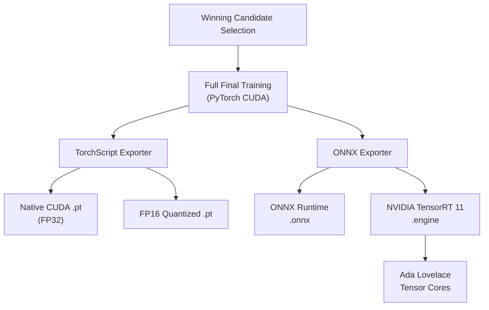

# 🛸 NeuroSwarm-AutoML

**Hardware-Aware Bi-Level Co-Evolutionary Neural Architecture Search & Tensor Core Acceleration Engine**

[](https://pytorch.org/)
[](https://developer.nvidia.com/tensorrt)
[](https://www.ray.io/)
[](https://fastapi.tiangolo.com/)
[](LICENSE)

---

## 📌 Executive Overview

**NeuroSwarm-AutoML** is a production-grade, hardware-aware Neural Architecture Search (NAS) framework engineered for high-dimensional computational graphs and real-time edge deployment.

Unlike single-objective NAS implementations that suffer from parameter bloat or decouple network structure from optimizer hyperparameter tuning, NeuroSwarm coordinates a **Bi-Level Co-Evolutionary Loop**:
1. **Upper-Level Topology Optimizer (GA):** Evolves discrete Directed Acyclic Graphs (DAGs) using graph mutation operators, subgraph crossovers, and cycle-prevention sanity enforcement.
2. **Lower-Level Hyperparameter Particle Swarm (PSO-DE):** Optimizes continuous hyperparameters (learning rate, momentum, weight decay, batch size) in real time alongside candidate topology updates.

Accelerated by **Gaussian Process (GP) Surrogate Filtering** with Upper Confidence Bound (UCB) acquisition, non-blocking CUDA transfers, PyTorch Automatic Mixed Precision (AMP), and native **NVIDIA TensorRT 11 serialization**, NeuroSwarm automatically searches, trains, quantizes, profiles, and deploys high-throughput models tailored to specific edge or server hardware.

---

## 🏗️ Core Architecture & Bi-Level Loop



## ⚡ Key Technical Features

* **Bi-Level Co-Evolutionary Optimization:** Synchronizes a Genetic Algorithm (GA) over discrete NetworkX DAG topologies with a Differential Evolution Particle Swarm (PSO-DE) over continuous hyperparameter spaces.
* **Gaussian Process Surrogate Estimation:** Accelerates candidate filtering by using a GP surrogate with UCB acquisition scoring, drastically reducing expensive PyTorch ground-truth training steps.
* **Hardware-Aware Fitness Penalty Function:** Constrains search spaces using measured hardware latency and FLOPs thresholds:
  $$F_{\text{constrained}}(\theta) = \text{Accuracy} - \alpha \cdot \max(0, \text{Latency} - \tau_{\text{latency}}) - \beta \cdot \max(0, \text{FLOPs} - \tau_{\text{flops}})$$
* **Distributed CUDA Execution Runner:** Supports multi-GPU process allocation via Ray remote tasks or Python `multiprocessing` with CUDA device context pinning.
* **Hook-Based Profiling:** Computes exact layer-by-layer FLOPs and parameter counts using custom execution hooks.
* **Multi-Format Export Engine:** Serializes trained candidates into `.onnx`, `.pt` (TorchScript FP32), FP16-quantized `.pt`, and serialized native NVIDIA `.engine` (TensorRT 11) binaries.
* **Async Server & Interactive Web UI:** Built-in FastAPI REST service with an embedded Gradio web app for drag-and-drop model evaluation.
* **Automated Executive Reporter:** Generates standalone `REPORT.md` markdown summaries with Pareto front tables, system hardware metadata, and architecture DAG visualizations.

---

## 📁 Repository Layout

```mermaid
flowchart TD
    ROOT["neuroswarm_automl/"]

    ROOT --> L1["launch.py<br/>Unified interactive execution launcher CLI"]
    ROOT --> L2["launch.bat<br/>Windows launcher"]
    ROOT --> L3["requirements.txt<br/>Python dependencies & CUDA packages"]
    ROOT --> L4[".gitignore<br/>Production gitignore"]
    ROOT --> SRC["src/"]

    SRC --> PKG["neuroswarm/"]

    PKG --> MAIN["main.py<br/>Core AutoML CLI entry point & search controller"]

    PKG --> CORE["core/"]
    CORE --> C1["candidate.py<br/>Candidate state & hardware fitness"]
    CORE --> C2["runner.py<br/>Distributed Ray / MP CUDA training"]

    PKG --> OPT["optimizers/"]
    OPT --> O1["base_optimizer.py<br/>Abstract optimizer interface"]
    OPT --> O2["ga_topology.py<br/>Upper-level DAG topology GA"]
    OPT --> O3["pso_de_continuous.py<br/>Lower-level PSO-DE"]
    OPT --> O4["bilevel_engine.py<br/>Bi-level co-evolution coordinator"]

    PKG --> SEARCH["search_space/"]
    SEARCH --> S1["dag_generator.py<br/>Random DAG creation & mutation"]
    SEARCH --> S2["dynamic_builder.py<br/>PyTorch module compiler"]

    PKG --> SURR["surrogates/"]
    SURR --> U1["base_surrogate.py<br/>Abstract surrogate interface"]
    SURR --> U2["gp_estimator.py<br/>Gaussian Process surrogate"]

    PKG --> UTIL["utils/"]
    UTIL --> V1["benchmark_pt.py<br/>PyTorch CUDA benchmark"]
    UTIL --> V2["benchmark_trt.py<br/>TensorRT benchmark"]
    UTIL --> V3["export.py<br/>ONNX & TorchScript exporter"]
    UTIL --> V4["quantize.py<br/>TorchScript FP16 quantizer"]
    UTIL --> V5["reporter.py<br/>Automated Markdown report"]
    UTIL --> V6["server.py<br/>FastAPI REST API & Gradio UI"]
    UTIL --> V7["trt_exporter.py<br/>TensorRT 11 FP16 engine builder"]

    classDef root fill:#1f2937,color:#fff,stroke:#111827,stroke-width:2px;
    classDef directory fill:#e8f1ff,color:#111827,stroke:#2563eb,stroke-width:2px;
    classDef file fill:#f8fafc,color:#111827,stroke:#64748b,stroke-width:1px;

    class ROOT root;
    class SRC,PKG,CORE,OPT,SEARCH,SURR,UTIL directory;
    class L1,L2,L3,L4,MAIN,C1,C2,O1,O2,O3,O4,S1,S2,U1,U2,V1,V2,V3,V4,V5,V6,V7 file;
```



## 📊 Deployment & Export Pipeline Architecture



## 📊 Hardware Performance Benchmarks

The following benchmark metrics were captured on an **NVIDIA GeForce RTX 4060 Laptop GPU (8.0 GB VRAM)** running a 12-node dynamic DAG architecture (`4f5974bd`) evolved over 100 classification targets (CIFAR-100) at batch size 32:

| Metric               | PyTorch Native CUDA (`.pt`) | TorchScript FP16 Quantized (`.pt`) | NVIDIA TensorRT 11 Engine (`.engine`) |   Performance Improvement   |
| :------------------- | :-------------------------: | :--------------------------------: | :-----------------------------------: | :-------------------------: |
| **Precision**        |            FP32             |                FP16                |        **FP16 (Tensor Cores)**        |  Half-precision throughput  |
| **Throughput (FPS)** |    6,499.70 samples/sec     |        6,550.20 samples/sec        |       **6,774.80 samples/sec**        |   **+275.10 FPS (+4.2%)**   |
| **Mean Latency**     |          4.9233 ms          |             4.8812 ms              |             **4.7008 ms**             |   **-0.2225 ms (-4.5%)**    |
| **Median (P50)**     |          4.8804 ms          |             4.8420 ms              |             **4.6816 ms**             |   **-0.1988 ms (-4.1%)**    |
| **P95 Latency**      |          5.0231 ms          |             4.9510 ms              |             **4.7657 ms**             |   **-0.2574 ms (-5.1%)**    |
| **P99 Tail Latency** |          5.7396 ms          |             5.6210 ms              |             **5.0608 ms**             |   **-0.6788 ms (-11.8%)**   |
| **Binary Size**      |           2.29 MB           |            **1.19 MB**             |                3.16 MB                | **-48.0% memory reduction** |

---

## ⚙️ Installation & Setup

### Prerequisites
* **Operating System:** Windows 10/11 or Linux (Ubuntu 22.04+)
* **Python Version:** Python 3.11+
* **CUDA Hardware:** NVIDIA GPU (Compute Capability 7.0+, e.g. RTX 30/40 series)
* **CUDA Toolkit:** CUDA 12.x & cuDNN 9.x

### 1. Clone & Setup Environment
```bash
git clone [https://github.com/your-username/neuroswarm-automl.git](https://github.com/your-username/neuroswarm-automl.git)
cd neuroswarm-automl

# Create and activate virtual environment
python -m venv .venv
source .venv/bin/activate  # On Windows: .venv\Scripts\activate
### 2. Install PyTorch & Dependencies

```bashpip install --upgrade pip
pip install torch torchvision --index-url [https://download.pytorch.org/whl/cu121](https://download.pytorch.org/whl/cu121)
pip install -r requirements.txt
### 3. Install TensorRT 11 CUDA Bindings

```bashpip install tensorrt tensorrt-cu12 tensorrt-cu12-bindings tensorrt-cu12-libs --extra-index-url [https://pypi.nvidia.com](https://pypi.nvidia.com)
## 🚀 Usage Guide

### Option A: Interactive Launcher Suite (Recommended)Launch the unified CLI menu via script or double-clicking launch.bat:```bash
python launch.py
```

```text====================================================================
🛸  NEUROSWARM-AUTOML EXECUTION LAUNCHER
    Bi-Level Co-Evolutionary Search & Acceleration Suite
====================================================================
1. 🛸 Run AutoML Search Engine
2. 🚀 Launch FastAPI Server & Gradio UI
3. ⚡ Run CUDA / TensorRT Latency Benchmarks
4. 🛠️ Export Model to TensorRT FP16 Engine
5. 📊 Compile Experiment REPORT.md Summary
6. ❌ Exit
--------------------------------------------------------------------
```
### Option B: Command Line Interface (CLI)

#### 1. Run Hardware-Aware AutoML Architecture Search

```bashPYTHONPATH=src python src/neuroswarm/main.py \
  --generations 8 \
  --population 10 \
  --short_epochs 3 \
  --final_epochs 15 \
  --min_nodes 6 \
  --max_nodes 12 \
  --base_channels 64 \
  --dataset cifar100 \
  --num_workers 2 \
  --use_ray \
  --output_dir ./outputs_cifar100_cuda
#### 2. Export ONNX Graph to Native TensorRT 11 Engine

```bashPYTHONPATH=src python src/neuroswarm/utils/trt_exporter.py \
  --onnx ./outputs_cifar100_cuda/winner_4f5974bd.onnx \
  --fp16 \
  --output_dir ./outputs_trt
#### 3. Benchmark Native TensorRT CUDA Execution

```bashPYTHONPATH=src python src/neuroswarm/utils/benchmark_trt.py \
  --engine ./outputs_trt/winner_4f5974bd.engine \
  --batch_size 32 \
  --num_classes 100 \
  --iterations 1000
#### 4. Launch FastAPI Server & Gradio Interface

```bashMODEL_PATH=./outputs_cifar100_cuda/winner_4f5974bd.onnx PYTHONPATH=src python src/neuroswarm/utils/server.py \
  --model ./outputs_cifar100_cuda/winner_4f5974bd.onnx \
  --device cuda \
  --port 8000
```

**REST API Prediction:** `POST http://localhost:8000/predict`
**Gradio Interactive Web UI:** `http://localhost:8000/ui`
**Swagger API Docs:** `http://localhost:8000/docs`

#### 5. Generate Automated Executive Report Prediction: POST http://localhost:8000/predictGradio Interactive Web UI: http://localhost:8000/uiSwagger API Docs: http://localhost:8000/docs#### 5. Generate Automated Executive Report

```bashPYTHONPATH=src python src/neuroswarm/utils/reporter.py --output_dir ./outputs_cifar100_cuda
## 🛠️ Hyperparameter Encoding Conventions

Continuous hyperparameter particles are represented as 4-dimensional vectors
$\mathbf{x} \in \mathbb{R}^4$ in the PSO-DE space and decoded dynamically during
PyTorch module compilation.

| Index | Parameter     | Vector Transformation                           | Decoded Domain / Bounds              |
| ----: | ------------- | ----------------------------------------------- | ------------------------------------ |
|     0 | Learning Rate | $	ext{lr} = 10^{\mathbf{x}_0}$                  | $[1 	imes 10^{-4}, 1 	imes 10^{-1}]$ |
|     1 | Adam $eta_1$ | $eta_1 = 	ext{clip}(\mathbf{x}_1, 0.8, 0.999)$ | $[0.800, 0.999]$                     |
|     2 | Weight Decay  | $	ext{wd} = 10^{\mathbf{x}_2}$                  | $[1 	imes 10^{-6}, 1 	imes 10^{-2}]$ |
|     3 | Batch Size    | $	ext{bs} = 2^{	ext{round}(\mathbf{x}_3)}$      | $\{16, 32, 64, 128, 256\}$           |

📜 License

Distributed under the MIT License. See LICENSE for more information.
